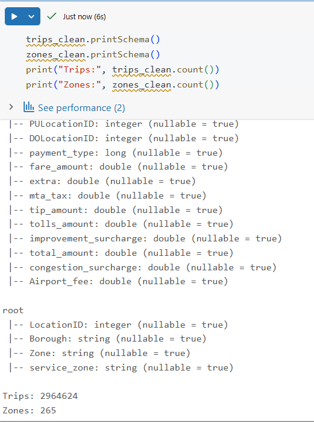
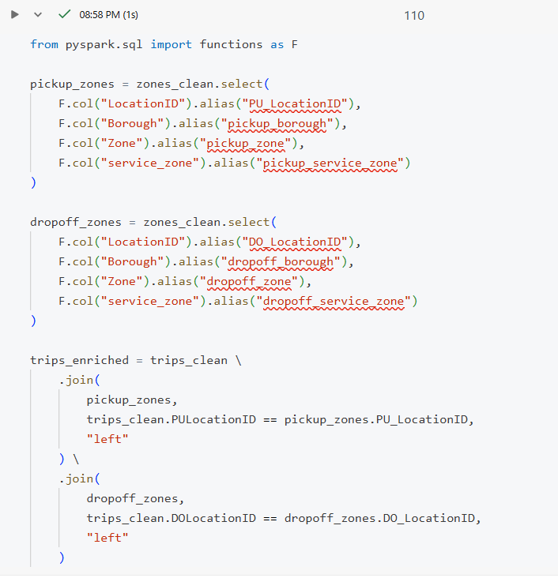
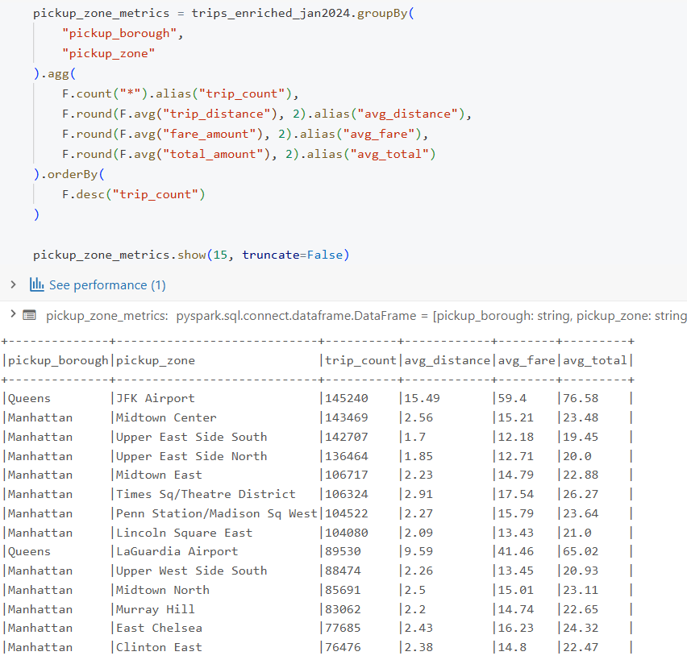
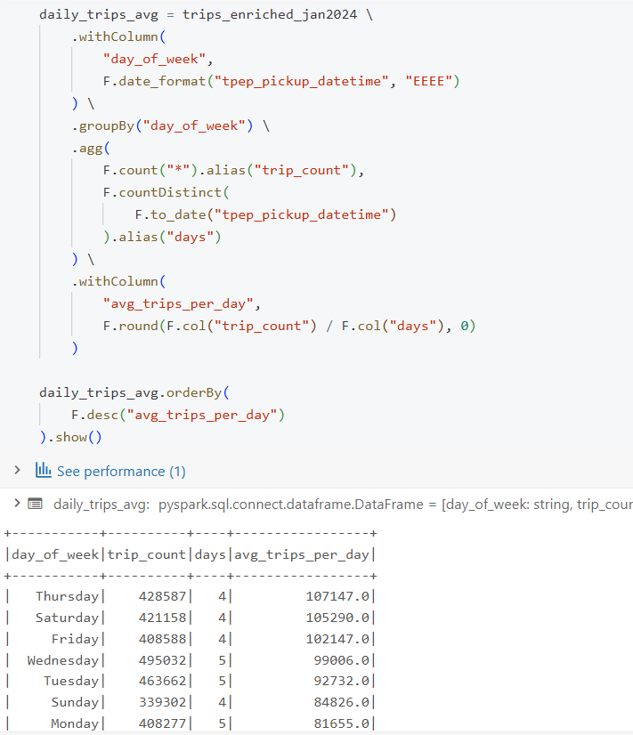
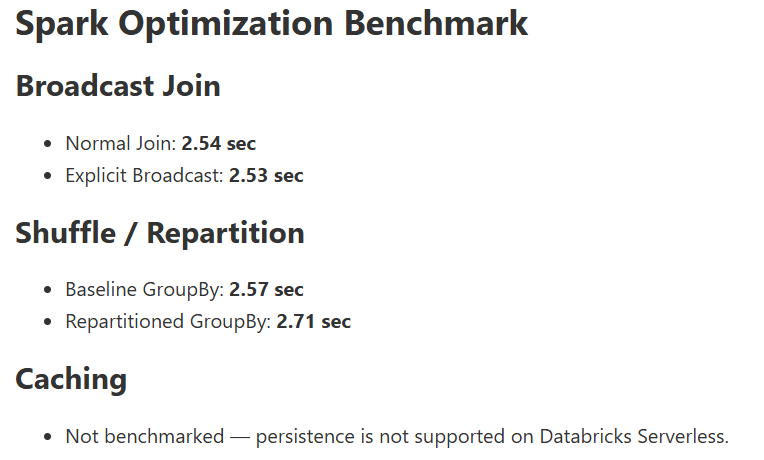

# 🚕 NYC Taxi Analytics & Spark Performance Optimization

An end-to-end **Apache Spark analytics and performance optimization project** built using **PySpark on Databricks** with the NYC Yellow Taxi Trip dataset.

This project demonstrates a practical Spark workflow — from raw data loading and data quality validation to data enrichment, business analytics, and Spark performance optimization.

The project focuses on both **business insights** and **how Spark executes analytical workloads**, including joins, aggregations, shuffle, Broadcast Join, Adaptive Query Execution (AQE), Photon, physical execution plans, and performance benchmarking.

---

## 📌 Project Overview

The objective of this project is to analyze millions of NYC taxi trips while building practical experience with **Apache Spark and Databricks**.

The project covers:

- Data loading and schema inspection
- Exploratory data analysis
- Data quality validation
- Data cleaning
- Data enrichment using dimension joins
- Business-oriented analytics
- Spark DataFrame and Spark SQL operations
- Physical execution plan analysis
- Spark performance optimization
- Benchmarking optimization techniques

### Project Workflow

```text
Raw Taxi Data
      │
      ▼
Data Loading
      │
      ▼
EDA & Data Quality
      │
      ▼
Data Cleaning
      │
      ▼
Data Enrichment
      │
      ▼
Business Analysis
      │
      ▼
Spark Performance Analysis
      │
      ▼
Optimization & Benchmarking
```

---

# 🛠️ Tech Stack

### Data Processing

- **Apache Spark**
- **PySpark**
- **Spark DataFrames**
- **Spark SQL**
- **Python**
- **SQL**

### Platform

- **Databricks**
- **Databricks Serverless Compute**
- **Databricks Photon**

### Spark Performance & Optimization

- Broadcast Join
- Shuffle Analysis
- Repartitioning
- Adaptive Query Execution (AQE)
- Physical Execution Plans
- Performance Benchmarking

### Data Formats

- Parquet
- CSV

### Version Control

- Git
- GitHub

---

# 📂 Project Structure

```text
NYC-spark
│
├── Data
│   ├── taxi_zone_lookup.csv
│   └── yellow_tripdata_2024-01.parquet
│
├── Notebook
│   └── NYC Taxi Analytics & Spark Performance Optimization.ipynb
│
├── screenshots
│   ├── 01_data_quality_cleaning.png
│   ├── 02_data_enrichment.png
│   ├── 03_pickup_zone_performance.png
│   ├── 04_average_trip_per_days_of_week.png
│   └── 05_optimization_benchmarks.png
│
├── .gitignore
└── LICENSE
```

---

# 📊 Dataset

The project uses the **NYC Yellow Taxi Trip Data for January 2024** together with the **NYC Taxi Zone Lookup** dataset.

## 🚕 Yellow Taxi Trip Data

The trip dataset contains approximately **3 million records** with fields including:

- Vendor ID
- Pickup datetime
- Drop-off datetime
- Passenger count
- Trip distance
- Rate code
- Pickup location ID
- Drop-off location ID
- Payment type
- Fare amount
- Tip amount
- Tolls
- Surcharges
- Total amount
- Airport fee

## 📍 Taxi Zone Lookup

The taxi zone dataset contains:

- Location ID
- Borough
- Zone
- Service zone

The zone lookup acts as a small **dimension dataset** used to enrich the trip records.

---

# 🧹 Data Quality & Cleaning

Before performing business analysis, the trip data was systematically investigated for data quality issues.

## 🔍 Validation Performed

- Duplicate record detection
- NULL value analysis
- Passenger count validation
- Trip distance validation
- Monetary value validation
- Rate code validation
- Payment type validation
- Location ID validation
- Datetime sequence validation
- Trip duration analysis

## 🧠 Cleaning Approach

The cleaning process followed an **evidence-based approach**.

Instead of automatically removing every unusual value, records were investigated first and modified only when sufficient evidence showed that a value was unreliable.

Examples:

- Exact duplicates were checked and no duplicates were found.
- `passenger_count = 0` was treated as unreliable and converted to NULL.
- Rare passenger count values were investigated rather than removed solely because of rarity.
- Negative monetary transactions were retained when related monetary fields showed a consistent transaction pattern.
- NULL values associated with `payment_type = 0` were retained because their intended values could not be reliably inferred.
- Pickup and drop-off location IDs were validated against the taxi zone lookup.
- Unusual pickup/drop-off timestamp sequences were investigated and retained when the intended timestamps could not be reliably determined.

After cleaning:

> **2,964,624 trip records** remained.

### 📷 Data Quality Validation



---

# 🔗 Data Enrichment

The raw trip dataset contains location IDs rather than descriptive location information.

The taxi zone lookup was therefore joined with the trip dataset to create an enriched analytical dataset.

The zone dimension was joined twice:

```text
                         Taxi Zone Dimension
                                │
                ┌───────────────┴───────────────┐
                │                               │
          Pickup Location                 Drop-off Location
                │                               │
                ▼                               ▼
        pickup_borough                    dropoff_borough
        pickup_zone                       dropoff_zone
        pickup_service_zone               dropoff_service_zone
                │                               │
                └───────────────┬───────────────┘
                                ▼
                       Enriched Trip Dataset
```

This enrichment created descriptive attributes such as:

- Pickup Zone
- Pickup Borough
- Pickup Service Zone
- Drop-off Zone
- Drop-off Borough
- Drop-off Service Zone

### 📷 Data Enrichment



---

# 📈 Business Analysis

After cleaning and enrichment, the project answered multiple business questions using **PySpark DataFrames and Spark SQL**.

## 🔎 Business Questions

- What are the busiest pickup zones?
- What are the busiest drop-off zones?
- What are the most frequent pickup → drop-off routes?
- How do major pickup zones compare in trip volume and average trip value?
- How does taxi demand vary by pickup hour?
- How does demand vary across weekdays?
- How do daily trip volume and revenue change throughout January?
- How do trip volume and average trip value vary by payment type?
- How do airport trips compare with non-airport trips?
- Which locations and time periods show notable demand patterns?

## ⚙️ Spark Operations Used

- `groupBy()`
- `agg()`
- `count()`
- `avg()`
- `sum()`
- `orderBy()`
- `withColumn()`
- Conditional expressions
- Date/time functions
- DataFrame joins
- Spark SQL aggregations

---

# 📍 Pickup Zone Performance

The analysis identified major demand centers across NYC.

High-volume pickup locations included:

- JFK Airport
- Midtown Center
- Upper East Side South
- Upper East Side North
- Midtown East
- Times Square / Theatre District
- Penn Station / Madison Square West
- LaGuardia Airport

The results showed that **airports and dense Manhattan locations** generate substantial taxi pickup demand.

### 📷 Pickup Zone Performance



---

# 📅 Demand by Day of Week

Weekday demand was analyzed while accounting for the different number of occurrences of each weekday within January 2024.

Raw weekday totals can be misleading because some weekdays occur more frequently than others within a month.

Therefore, average daily demand was also considered to provide a more meaningful comparison.

### 📷 Day-of-Week Analysis



---

# ✈️ Airport vs Non-Airport Analysis

Airport trips were compared with non-airport trips using:

- Trip count
- Average trip distance
- Average trip value

| Category | Trip Count | Avg Distance | Avg Trip Value |
|----------|-----------:|-------------:|---------------:|
| Non-Airport | 2,729,836 | 2.83 mi | $22.90 |
| Airport | 234,770 | 13.24 mi | $72.17 |

### Key Observation

Airport trips represented a smaller portion of total trip volume but had substantially higher average distance and trip value.

This highlights the difference between short urban taxi trips and longer airport-oriented trips.

---

# ⚡ Spark Performance Optimization

A major part of this project was understanding **how Spark executes analytical workloads**, rather than simply applying optimization techniques.

Performance experiments were performed using **Databricks Serverless Compute with Photon**.

The goal was to measure whether manual optimization techniques actually improved execution time.

---

## 🔥 1. Broadcast Join

A representative join between the large trip dataset and the small taxi zone dimension was benchmarked.

| Approach | Execution Time |
|----------|---------------:|
| Normal Join | 2.54 sec |
| Explicit Broadcast | 2.53 sec |

The physical execution plan for the normal join already showed:

```text
PhotonBroadcastHashJoin
```

This indicated that Databricks/Photon automatically selected a broadcast join for the small dimension table.

### Conclusion

Explicitly adding `broadcast()` produced **no meaningful performance improvement** because Spark had already selected an appropriate join strategy automatically.

---

## 🔀 2. Shuffle & Repartitioning

A `groupBy()` aggregation was used as a representative shuffle-intensive workload.

| Approach | Execution Time |
|----------|---------------:|
| Baseline GroupBy | 2.57 sec |
| Repartitioned GroupBy | 2.71 sec |

The physical plan showed a shuffle during the aggregation.

However, explicitly repartitioning by `pickup_zone` introduced additional shuffle work and increased execution time.

### Conclusion

Manual repartitioning was **not retained** because it did not improve this workload.

---

## 🧠 3. Adaptive Query Execution

The physical execution plan showed:

```text
AdaptiveSparkPlan
```

This confirmed that **Adaptive Query Execution (AQE)** was active in the Databricks environment.

AQE allows Spark to adapt parts of query execution using runtime information.

---

## 🚀 4. Photon Engine

The tested workloads were executed using **Databricks Photon**.

The physical plans showed Photon execution for the analyzed workloads, including:

- Broadcast Join
- Aggregation
- Shuffle-based operations

This provided practical exposure to Spark execution beyond simply writing DataFrame transformations.

---

## 💾 5. Caching

Caching was considered because the enriched dataset was reused across multiple analytical operations.

However, the current **Databricks Serverless environment does not support the persistence operations required for DataFrame caching**.

Therefore, caching could not be benchmarked in this environment.

---

# 📊 Optimization Benchmark

| Optimization | Baseline | Alternative | Result |
|--------------|---------:|------------:|--------|
| Broadcast Join | 2.54 sec | 2.53 sec | No meaningful improvement |
| Repartition | 2.57 sec | 2.71 sec | Slower |
| Caching | — | — | Not benchmarked on Serverless |

### 📷 Optimization Results



---

# 💡 Key Insights

## Business Insights

- Airports and major Manhattan zones generate substantial taxi demand.
- Airport trips have significantly higher average distance and trip value than non-airport trips.
- Evening hours show the highest taxi demand.
- Pickup demand is concentrated in specific high-density zones.
- Trip volume and average trip value do not always peak at the same time.

## Spark Insights

- Databricks/Photon can automatically select suitable execution strategies.
- Small dimension tables are suitable candidates for broadcast joins.
- Manual repartitioning can increase execution cost when applied unnecessarily.
- AQE can adapt query execution at runtime.
- Photon accelerates supported Spark workloads.
- Optimization should be based on **execution plans and measurements**, not assumptions.

---

# 🧠 Key Concepts Implemented

- Apache Spark
- PySpark
- Spark DataFrames
- Spark SQL
- Databricks
- Databricks Serverless
- Photon
- Adaptive Query Execution
- Data Quality Validation
- Data Cleaning
- Data Enrichment
- DataFrame Joins
- Broadcast Join
- Shuffle
- Repartitioning
- Aggregations
- Business Analytics
- Physical Execution Plans
- Performance Benchmarking
- Parquet Data Processing

---

# 📓 Notebook

Complete implementation is available in:

```text
Notebook/NYC Taxi Analytics & Spark Performance Optimization.ipynb
```

The notebook includes:

- Data loading
- Schema inspection
- Exploratory analysis
- Data quality investigation
- Data cleaning
- Data enrichment
- Business questions
- Spark SQL analysis
- Performance benchmarking
- Physical plan analysis
- Spark optimization experiments

---

# 📷 Project Screenshots

### Data Quality & Cleaning


### Data Enrichment


### Pickup Zone Performance


### Day-of-Week Analysis


### Spark Optimization


---

# 📚 Dataset

**NYC Yellow Taxi Trip Data**

**Period:** January 2024

Supporting dataset:

**NYC Taxi Zone Lookup**

The project uses the January 2024 trip data together with the taxi zone dimension for analytical enrichment.

---

# 🚀 Project Outcome

This project provided hands-on experience with a complete Spark-based analytical workflow:

```text
Load
  ↓
Understand
  ↓
Clean
  ↓
Enrich
  ↓
Analyze
  ↓
Optimize
  ↓
Measure
```

The project demonstrates that Spark performance optimization should be **measured and validated using execution plans and benchmarks**, rather than applied blindly.

It combines **data quality, data enrichment, business analytics, and Spark performance engineering** in a single practical project.

---

# 👨‍💻 Author

**Vikas Mishra**

Aspiring Data Engineer

**Python | SQL | PySpark | Apache Spark | Databricks | Data Warehousing**
